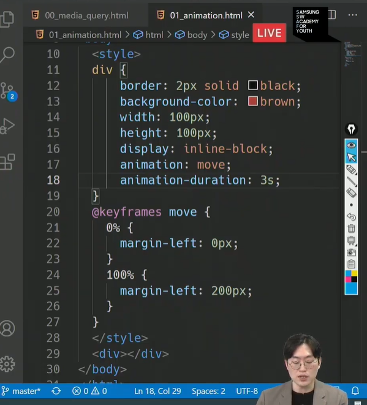
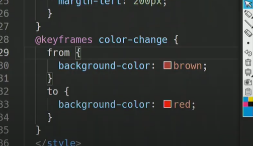
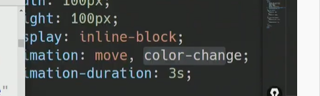
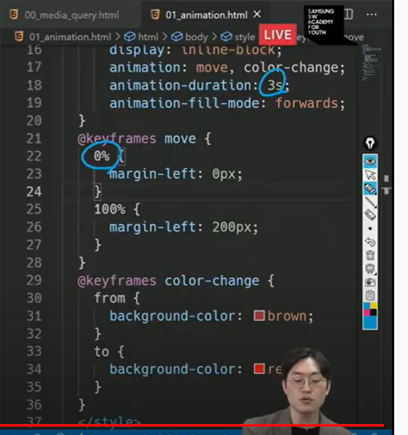
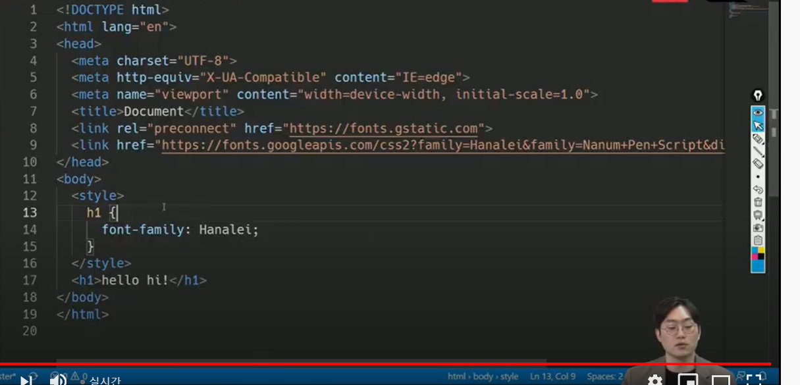

# Web02 (2.3)

- 마진요소는 블록요소의 top, bottom에만 나타남

- 가운데정렬은 블록의 경우 margin 0 auto / 텍스트일 경우 text-align:center

- float clear : 빨간색이 float left되어도 파란색 사각형이 못 올라가게 하는 방법

  clear가 바로 float을 무시하겠다는 것

  ppt 상에서 clearfix를 만들어서 해줌 . float땜에 깨지는 것을 방지! float된 요소의 부모에게 cleaerfix 클래스를 적용한다!

- 시작할 때 CDN 링크 받아오는거 해야함 !!

- md, sm, lg 이런거는 768이상이면 다 해당되는 것, 따라서 각 기준점마다 해줄 필요는 없음. 

- 대표적인 블록레벨 요소

  - div / ul , ol, li / p / hr / form

- 대표적인 인라인레벨 요소

  - span / a / img / input, lable / b , em, i, string 

##### flex box

- container로 item들을 조작한다.
- 축(메인, 교차) 
  - 메인 축 방향만 바뀐다
  - 기본 축(main-axis)의 방향 : 왼>오, 위> 아래
  - colum-reverse에 화살표는 메인축이고, 이거에 수직인 값이 교차축
  - justify : 메인축정렬, align: 교차축정렬
  - content:여러줄, items:한줄, flexitem:개별요소
- flex direction 의 기본값은 row이다. 
- 부모요소에 display flex 선언을 하면 그 안에 요소들이 flex item으로 변경이 되는것

- direction이 메인축의 방향을 결정하는 것이고, justify가 메인축 정렬, align이 교차축 정렬인것 !!!!!!


- justify에서는 한줄이어도justity-content사용 가능 
- flex-direction은 시작점을 정의하네. reverse와 reverse 아닌 것 

https://flexboxfroggy.com/#ko

연습

##### Grid

bootstrap

- responsive : 반응형, 어떤 디바이스로 들어와도 볼 수 있음 (one source multi use)
- grid 유용하게 쓸 수 있다.
- 파일에서 bootstrap.css 또는 bootstrap.min.css 만 이용 map은 컴퓨터가 디버깅할 때 쓰는 것!
- 부트스트랩 적용하면 글자 굵기가 없어지고, 모서리에 글씨가 딱 붙는 느낌, 이게 CSS를 초기화한 것 (reboot 파일)
- CDN으로 url링크 가져와서 사용하면 된다. 2.3 05번 파일
- bootstrap홈페이지에서 검색해서 원하는 설정 사용
- text-sm-start, text-md-start 이런건 반응형 
- flexbox grid / 이 부트스트랩 자체를 플랙스박스 기반으로 만들어져있음 , 결국 안에 있는 콜들이 플랙스 아이템이 되는 것!
- 12개의 컬럼, 6개의 grid breakpoints 중요
- row, col3개는 하나의 행에 열이 3개 
- 12인 이유 : 약수가 많아서 레이아웃이 다양하게 가능
- 부트스트랩에 grid 쓰면 gird-options에 크기들이 나옴
  - d-sm-none : sm이상 넘어가면 none이 된다.(none:없어지는것)
  - d-md-block : width가  md이상이 되면 block이 되게 하겠다. (block:다시  보인다. 블럭소성 회복)
- 컨테이너, 로우, 콜 이 그리드의 기본 구조
- 그리드 시스템 예시들을 복붙해서 확인해보기
- mt-1 : margin top 0.25rem
- mx-0 : margin 좌우 0
- py-0 : padding 상하 0
- label for과 input의 id가 연결되면 label 눌렀을 때 input으로 연결됨 


```
<section>
    <h2 class="text-center mt-5 mb-5">Used Skills</h2>
    <article class="d-flex justify-content-evenly">
      <div>
        
        <p class="">Web</p>
      </div>
      <div>
        
        <p>HTML5</p>
      </div>
      <div>
        
        <p>CSS3</p>
      </div>
    </article>
  </section>
```

- 자주 쓸만한 부트스트랩 클래스

  - container : 기본으로 많이 쓰는듯 /컨텐츠를 포함, 중앙배치 등등 이용

  - Components > modal : 팝업창/여러개가능은 한데 button의 data-bs-target값과 class의 id가 같아서 팝업창이 동일한거로 뜰 수 있음 / 각각 서로 일치시켜야함 
  - Components > Carousel : 이미지넘기기/추가로 이미지 넣어줘야함 / id랑 href 가 일치 / carousel이 여러개 쓴다면 id가 각각 일치
  -  Components > Grid Card : 카드가 한 화면에 여러개 / row-clos-md-2이면 md이상이면 카드 2개 보여준다 /  g-4는 카드들 사이 간격, (margin, padding을 적절하게 처리한 것)  / g를 없애면 p는 좌우에 기본적으로 들어가있기 때문에  상하에 간격이 없어진다. / g-0을 하면 p도 없어져서 서로 다닥다닥 붙음.
  - Components > Badge
  - Components > Collapse, Pagination, Progress, Togle, Dropdown
  - Gutters도 유용할듯!


##### CSS 애니메이션

```css
move는 함수 이름
@keyframes move{
    0%
    {
        margin-left: 0px;
    }
    100% {
        
    }
}
```









- style.css = 애니메이션

- 구글폰트 = 폰트 (select this style > head에 title밑에다가 넣음 > ), 아래 사진 참고



- 아이콘 = 부트스트랩, font awesome

- 접근성 향상 = 아이콘 기호 안에 span으로 글자 넣어줌 


##### PJT 03 참고사항

- 로그인- 모달
- Nav 상단 고정 : fixed top
  - 로고 이미지 링크로 
  - ul과 li태그 다시 이용 + flex + 부트스트랩 이용하기  (homework 교수님 코드 참고)
  - 햄버거 버튼 교체 
  - 디테일 요소들은 알아서
- 본문 > card, carousel, 
- 푸터 
- 커뮤니티 
  - 리스트, table(Content), 

